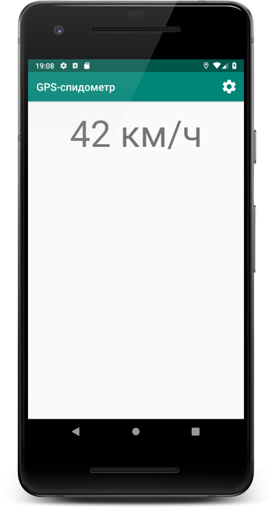
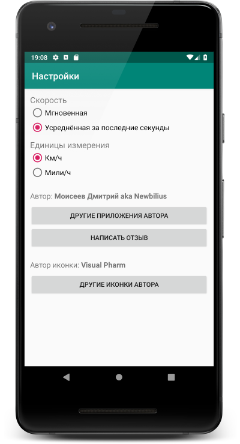

# Простейший GPS-спидометр (Android)

Простенькая программа, измеряющая скорость по GPS. Что есть минимально интересного в коде:

* эксперименты с Data Binding (неплохой, но местами неприятно глюковатый инструмент)
* вьюшки + вьюмодели (без чистых моделей)
* возможность добавлять разные способы измерения скорости ([IGPSSpeedCounter](app/src/main/java/com/newbilius/simplegpsspeedometer/GPSSpeedCounters))
* кольцевой буфер для одного из вариантов подсчёта скорости ([звучит круче](app/src/main/java/com/newbilius/simplegpsspeedometer/Utilities/RingBufferOfFloat.java) чем выглядит на практике :D)

## На какие проблемы наступил с Data Binding:
* работа на Android 4.1 и 8+ может отличаться ([коммит 6a1f14829d176ad5fe994fc3e1c5ba7e863b0205](https://github.com/Newbilius/GPS_Speedometer/commit/6a1f14829d176ad5fe994fc3e1c5ba7e863b0205))
* генерация ломается, если ViewModel разместить не в корневом пакете
* генерация иногда ломается сама по себе, чинится только перезеапуском и очисткой кэша IntelliJ IDEA

## Скриншоты

 

## Ссылка на Google Play
https://play.google.com/store/apps/details?id=com.newbilius.simplegpsspeedometer